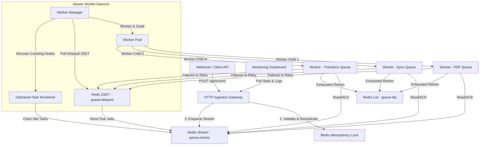

# NexusFlow // High-Concurrency Distributed Task & Event Processor

NexusFlow is a high-concurrency, resilient, distributed task and event processing engine built in PHP 8.4 and Redis. Designed with senior-level architecture and best practices, it moves beyond basic database writes to showcase process fork management, signal interception, idempotency caching, exponential backoff retries, and automated crash recovery.

---

## 🏗️ System Architecture



---

## 🚀 Key Features & Architectural Patterns

### 1. Broker Layer (Redis Streams & Consumer Groups)
Instead of standard queues, NexusFlow uses **Redis Streams** (`XADD`, `XREADGROUP`, `XACK`). This enables:
- **Load Balancing**: Multiple concurrent workers can read from the same stream; Redis automatically distributes messages across consumers in the group.
- **Delivery Guarantee**: Read messages enter the Pending Entry List (PEL). If a worker fails to acknowledge a task (`XACK`), the event is never dropped.
- **Resource Cleanup**: Successfully processed and acknowledged messages are deleted (`XDEL`) to prevent memory leaks in high-throughput environments.

### 2. Multi-Process Orchestrator (`pcntl_fork`)
The worker manager run is a persistent CLI daemon (`bin/worker-manager`):
- **POSIX Signal Interception**: Uses `pcntl_async_signals(true)` and `pcntl_signal` to trap `SIGTERM` and `SIGINT` signals, triggering clean, graceful terminations for all active worker child processes.
- **Zombie Process Prevention**: Non-blockingly reaps finished or crashed worker processes using `pcntl_waitpid(-1, $status, WNOHANG)`.

### 3. Dynamic Backlog Auto-Scaling
The orchestrator monitors queues and scales processes up and down:
- **Backlog Limits**: Configurable per queue. For example, `api-sync` spawns 1 worker per 5 pending messages.
- **Cool-Down Delay**: When load drops, the manager waits 10 seconds before terminating excess workers via `SIGTERM` signals to avoid rapid process thrashing.

### 4. Exponential Backoff & DLQ Buffering
- **ZSET Delayed Scheduling**: If a task handler throws an exception, the worker calculates an exponential backoff time (`base_delay * (multiplier ^ attempt)`) and saves it in a Redis Sorted Set (`queue:delayed`).
- **Delayed Dispatcher**: The master daemon polls the ZSET and atomically transfers due jobs back to active streams using a lock-free "rem-then-enqueue" pattern.
- **Dead Letter Queue (DLQ)**: Tasks that exceed maximum configured retries (e.g. 3 attempts) are routed to a Redis List (`queue:dlq`) for manual recovery or inspection.

### 5. Task Deduplication (Idempotency Locking)
Clients supply a unique `idempotency_key` or `event_id`. NexusFlow uses Redis `SET key val NX EX ttl` locks:
- Prevents concurrent executions of duplicate jobs.
- Caches completed jobs (`status:idempotency:$key`). Subsequent requests receive a fast-pass `200 OK` return.

### 6. Orphaned Task Recovery (Crash Resiliency)
If a worker process crashes abruptly (e.g., Segfault, Out of Memory) while executing a task, the task remains in-flight in Redis. The orchestrator periodically runs a reclaimer:
- Identifies pending messages that have been idle/un-ACKed for longer than 60 seconds.
- Uses `XCLAIM` to take ownership.
- Re-enqueues them with incremented attempts, or pushes them to the DLQ if they exceed 3 delivery attempts (preventing "poison pill" infinite loops).

---

## 🛠️ Installation & Setup

1. **Verify Requirements**:
   - PHP >= 8.4
   - `redis`, `pcntl`, and `posix` extensions enabled
   - Redis server running on port `6379`

2. **Clone & Install Dependencies**:
   ```bash
   composer install
   ```

---

## 💻 Running the Application

For a full live demonstration, start the system components in separate terminal sessions:

### 1. Start the Worker Daemon
Runs the master coordinator which spawns workers and monitors streams:
```bash
php bin/worker-manager
```

### 2. Start the HTTP Gateway Web Server
Serves the monitoring dashboard and the REST API endpoints:
```bash
php -S 127.0.0.1:8000 -t public/
```

### 3. Open the Dashboard UI
Navigate to **`http://localhost:8000`** in your browser. You will see a premium glassmorphic interface showing:
- Real-time throughput graphs (Events per second).
- Backlog meters for each queue.
- Live worker registries detailing process IDs and states (`idle` / `busy`).
- Interactive triggers to inject load or manage the Dead Letter Queue.
- A live tail of the telemetry log file.

### 4. Trigger Loads (CLI)
You can also inject high-volume mock events directly from the command line:
```bash
# Inject 50 random jobs across all queues
php bin/producer --count=50

# Inject 10 jobs specifically targeting the api-sync queue
php bin/producer --count=10 --queue=api-sync
```

---

## 🧪 Running Automated Tests

NexusFlow includes a strict automated PHPUnit test suite.
Integration tests run against a dedicated Redis database (`15`) to isolate tests from development data:

```bash
vendor/bin/phpunit
```
