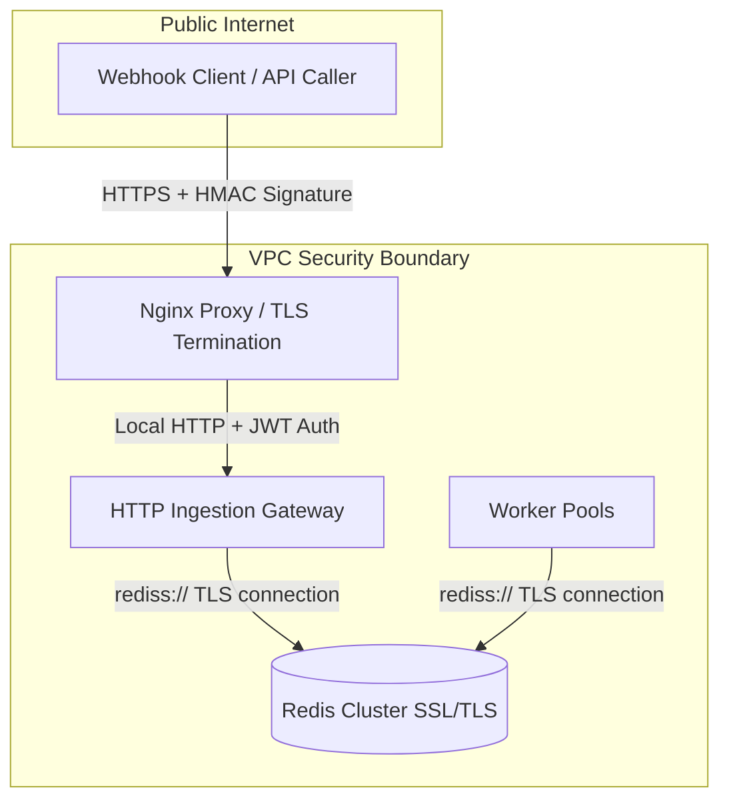

# NexusFlow // Production Security, Resilience, & Compliance Audit

This document details the architectural blueprints, policies, and designs required to deploy NexusFlow in security-critical, high-availability enterprise environments.

---

## 🔐 1. Security Architecture

Running NexusFlow in production requires securing two key interfaces: the **HTTP Ingestion Gateway** and the **Redis Broker**.



### A. Authentication & Webhook Verification
1. **HMAC Signature Verification (Recommended)**: For webhook ingestion, the gateway should verify requests using a shared secret key via HMAC (SHA256). The caller signs the payload body, and the gateway verifies it before placing it in the stream:
   ```php
   $signature = $_SERVER['HTTP_X_NEXUSFLOW_SIGNATURE'] ?? '';
   $computed = hash_hmac('sha256', $rawBody, $webhookSecret);
   if (!hash_equals($signature, $computed)) {
       jsonResponse(['error' => 'Unauthorized signature'], 401);
   }
   ```
2. **Bearer Token Authentication**: For internal system APIs, access to `/api/events`, `/api/metrics`, and DLQ controls must be gated using standard JSON Web Tokens (JWT) or API Keys in the `Authorization` header.

### B. Role-Based Access Controls (RBAC)
Enterprises must segment access to the dashboard and API:
- **Read-Only Role (Operators)**: Can view `/api/metrics`, worker registries, and logs.
- **Read-Write Role (Admins)**: Can trigger load tests, retry or purge the DLQ, and ingest events.
- *Implementation*: Gated in `public/index.php` by parsing JWT scopes:
  ```php
  $userScopes = $token->getClaim('scopes'); // ['metrics:read', 'dlq:write']
  if ($requiresWrite && !in_array('dlq:write', $userScopes)) {
      jsonResponse(['error' => 'Forbidden'], 403);
  }
  ```

### C. Network Encryption (TLS/SSL)
1. **Transit Encryption**: Ensure all client-to-gateway traffic runs over HTTPS (terminated via a reverse proxy like Nginx or AWS ALB).
2. **Broker Encryption**: Connect to Redis using the `rediss://` scheme to encrypt all cache, stream, and authentication payloads in transit:
   ```php
   $redis->connect('tls://127.0.0.1', 6379);
   ```

---

## ⚡ 2. Edge Case Resilience ("Unhappy Paths")

NexusFlow is architected on "at-least-once" delivery guarantees to handle catastrophic failures.

### A. Redis Server Outages & Restarts
- **Persistence**: Redis must be configured with **AOF (Append Only File)** enabled and `appendfsync everysec` to prevent data loss on power failures.
- **Auto-Recovery**: If Redis crashes, PHP workers lose connection. Both `Worker` and `WorkerManager` catch `RedisException` in their loops, backoff (e.g. sleep 2s, then 4s, then 8s), and re-establish the connection. The daemon processes do not crash; they enter a self-healing wait state.

### B. Network Partitions Mid-Execution
- **PEL Protection**: When a worker reserves a job (`XREADGROUP`), Redis moves the event to the Pending Entry List (PEL). If a network cable is unplugged before the worker calls `XACK`, the job remains in the PEL.
- **Orphan Reclamation**: Once the network recovers, the orchestrator's **Orphaned Task Reclaimer** identifies the idle job, claims it (`XCLAIM`), and re-enqueues it for another worker. **Zero events are lost.**

### C. Host Disk Space Exceeded
- **Log Rotation**: In production, the simple file logging must be coupled with `logrotate` to prevent logs from clogging the host system.
- **Redis Eviction Policy**: Redis must be configured with the `noeviction` policy:
  ```ini
  maxmemory-policy noeviction
  ```
  If Redis runs out of memory, it will refuse new writes (`XADD` returns an error to the API caller), but it will **never delete queued events**, ensuring data integrity.

---

## 📊 3. Enterprise Observability

To run a mission-critical event loop, engineers need to inspect state telemetry.

### A. Real-Time Logs Integration
The structured JSON log output from `Logger.php` can be piped directly to standard collectors:
- **AWS CloudWatch** / **Datadog Agent** / **Logstash**: Parses the PID, log level, and JSON context to index variables like `job_id`, execution `duration`, and error class.

### B. Queue Depth & Metric Monitoring
Enterprises should export `/api/metrics` to **Prometheus** via a custom exporter. Crucial metrics to watch:
- **`nexusflow_queue_backlog`**: Total unread events. An increasing backlog indicates workers are under-provisioned.
- **`nexusflow_dlq_count`**: Total terminal failures. If this count increases, it triggers alerts for manual engineering intervention.
- **`nexusflow_worker_health`**: Active heartbeat count. Alert if active workers < configured `min_workers`.

---

## 🇪🇺 4. Compliance Guidelines (GDPR, SOC2, HIPAA)

When handling customer records, NexusFlow satisfies compliance mandates through strict data practices.

### A. Data Minimization (No PII in Payloads)
- **Architectural Rule**: **Never store Personally Identifiable Information (PII)** or Protected Health Information (PHI) directly inside the event payload.
- **Best Practice**: Payloads should only contain references (e.g., `user_id`, `order_id`, `record_uuid`). Workers should query secured SQL databases or internal APIs using transit tokens to retrieve the sensitive data during execution. This limits the data scope in Redis and logging streams.

### B. Encryption at Rest
- **Redis Encrypted Storage**: Enable disk encryption (AWS KMS / LUKS) on the volumes storing Redis AOF files.
- **Logs Encryption**: Ensure the destination log aggregates (Elasticsearch / CloudWatch) utilize envelope encryption at rest.

### C. Audit Trails (SOC2 Compliance)
Every state transition of a job is fully logged:
- **Trace ID Propagation**: The `idempotency_key` acts as the global Correlation ID / Trace ID.
- **Lifecycle Logging**: Logs record `Pushed` -> `Reserved` -> `Succeeded` (with duration) OR `Failed` (with backoff index) -> `DLQ` (with error message). This allows security teams to audit the lifecycle of any event.
